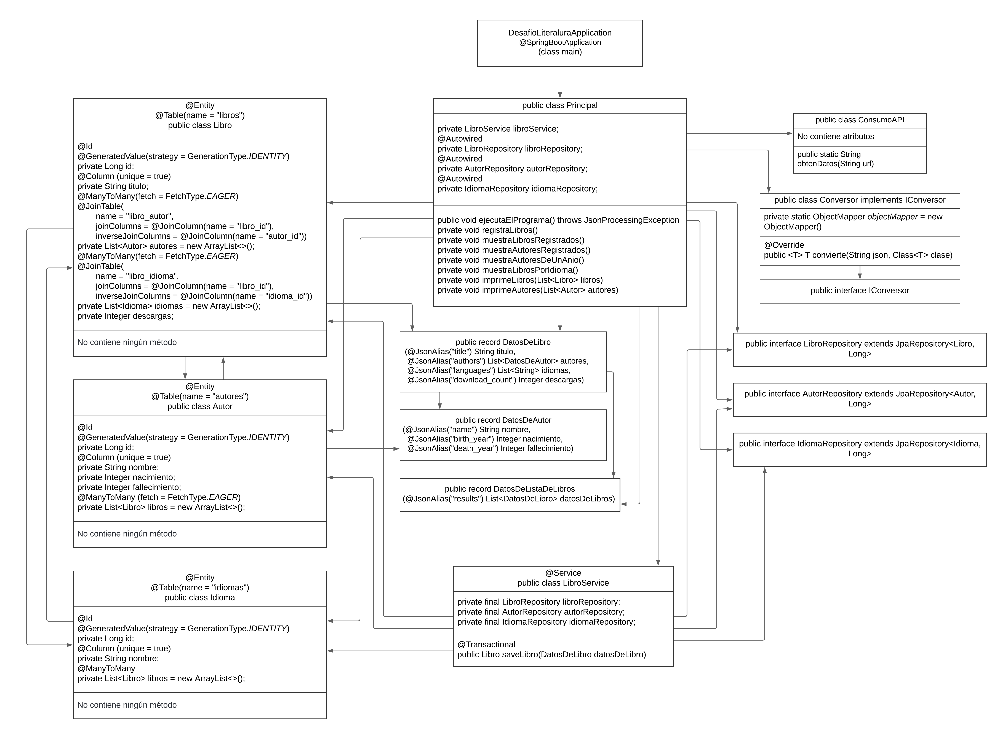
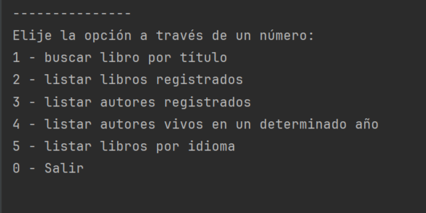
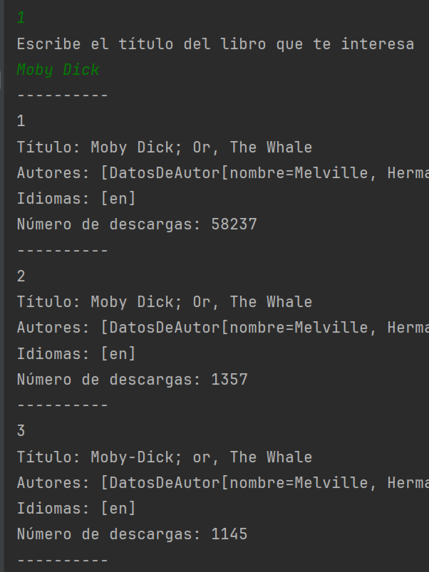
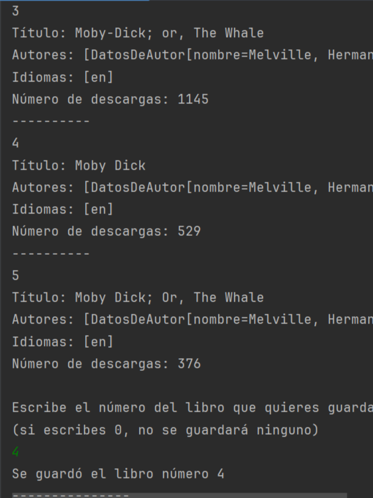
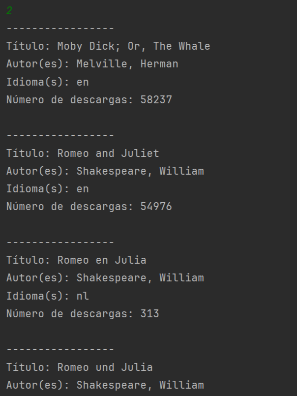
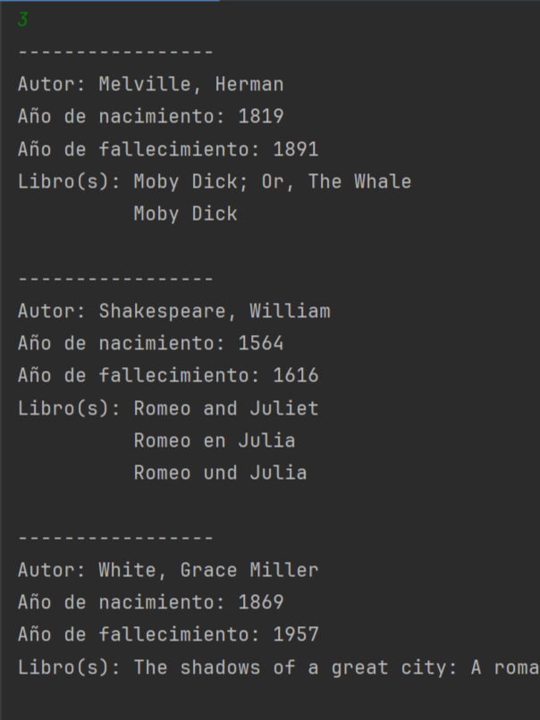
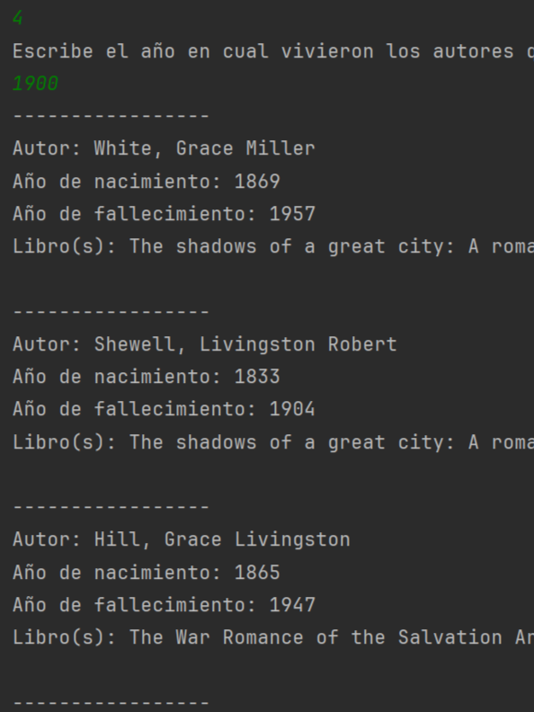
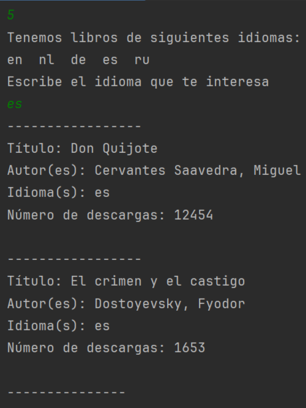

# Literalura

  
  

Esta aplicación de back-end llena tu base de datos con los datos de libros que los encuentras en gutendex.com. Posteriormente puedes ver los libros, los autores, los libros de cierto idioma y los autores que vivieron cierto año.

## Descripción del proyecto
Esta aplicación se realizó como parte de la formación en Oracle Next Eucation (ONE), usando Spring Boot, API y Base de datos.

Comunicación con la Aplicación se realiza en la consola a través dl siguiente menú:

Elije la opción a través de un número:
- 1 - buscar libro por título
- 2 - listar libros registrados
- 3 - listar autores registrados
- 4 - listar autores vivos en un determinado año
- 5 - listar libros por idioma
- 0 - Salir

El proyecto incluye procesos complejos como:

- Construcción de la aplicación Java con Spring Boot
- Implementación de la biblioteca Jackson
- Construcción y uso de base de datos relacional 
- Uso de llaves forranes para conectar tres modelos con Many to Many
- Uso de Spring Data JPA

Mejoramiento del proyecto básico:

El proyecto propuso guardar solo un autor para cada libro y solo un idioma. Esto sería la tarea mucho más sencilla de la que se hizo, aseptando la lista de autores y posible lista de idiomas de cada libro. Esto aumentó consideradamente la complejidad de la base de datos y las consultas en el momento de buscar los datos.

## Organización de código
El proyecto contiene:
- La aplicación inicial DesafioLiteraluraApplication.java que está construida por Spring e inicia todo el programa Principal
- Los programas en 4 paquetes
- Dependencias necesarias en el archivo pom.xml
- Declaracion de la base de datos en application.propeties

Código en 4 paquetes está organizado en la siguiente manera:
- principal
    - Principal.java
        - Lleva tolo del proceso de la aplicación controlándolo a través de menú. Cada opción de menú se lleva a cabo con su respectivo método interno.
- modelos
    - Libro.java  
        - Es la clase que define los atributos del libro, su tabla "libros" en la base de datos y su conexión ManyToMany con lel modelo Autor.java y su tabla "autores" y con el modelo Idioma.java y su tabla "idiomas"
    - Autor.java
        - Es la clase que define los atributos del autor, su tabla "autores" en la base de datos y su conección ManyToMany con Libro.java.
    - Idioma.java
        - Es la clase que define los atributos del idioma, su tabla "idiomas" en la base de datos y su conección ManyToMany con Libro.java.
    - DatosDeLibro.java
        - Es un record que hace la conección entre datos de libro de Json y de las variables de la aplicación
    - DatosDeAutor.java
        - Es un record que hace la conección entre datos de autor de Json y de las variables de la aplicación
    - DatosDeListaDeLibros.java
        - Es un record que hace la conección entre la lista de libros que nos ofrece Json y la lista de libros de la aplicación
- repository
    - LibroRepository.java 
        - Es el repositorio para buscar libros en la base de datos usando las consultas correspondientes
    - AutorRepository.java
        - Es el repositorio para buscar autores en la base de datos usando las consultas correspondientes
    - IdiomaRepository.java
        - Es el repositorio para buscar idiomas en la base de datos usando las consultas correspondientes
- service
    - ConsumoAPI 
        - Esta clase se encarga de obtener datos de API proporcionandole la liga como parámetro y regresarnos los datos como un Json
    - Conversor.java
        - La clase que convierte el Json en el modelo, usando el modelo tipo generico de modelos
    - IConversor.java 
        - Es el interface que define el tipo generico
    - LibroService.java
        Esta clase hace todos los chequeos y pasos necesarios para guardar el libro encontrado y lo guarda en la base de datos, cada dato en su correspondinte tabla: "libros", "autores" e "idiomas"
    

Dependencias usadas en el archivo pom.xml
- spring-boot-starter
- spring-boot-starter-test
- spring-boot-starter-data-jpa
- postgresql
- jackson-annotations
- jackson-core
- jackson-databind
- spring-boot-devtools
- spring-data-commons

Para que la aplicación se pueda ejecutar, necesita:
- definida la base de datos que se vaya a ocupar

## Organización en la forma gráfica
En la siguinte imagen UML se muestra el sistema de la:

## Demostración de aplicación

Menú:

  

Opción 1:

  
  

Opciónes 2 y 3:

  
  

Opciónes 4 y 5:

  
  

## Cómo usar la aplicación
Para poder probar o usar la aplicación se requeiere seguir los siguientes pasos:
1. Descarga todos los archivos y carpetas en una carpeta en tu computadora.
    - esto puedes hacer usando la consola o precionando boton verde "Code" en el repositorio de GitHub y escoges Download ZIP
2. Crea la base de datos de postgre en tu computadora
3. Define las siguientes variables de retorno en tu sistema operativo (Windows o Mac):
    - DB_HOST   tu_host (si tienes la base de datos en tu computadora, pones localhost)
    - DB_NAME_LITERALURA   nombre_de_tu_base_de_datos
    - DB_USER   postgre 
    - DB_PASSWORD   tu_password_de_postgre
4. Abre el proyecto en IntelliJ.
5. Run la clase DesafioLiteraluraApplication.

## Tecnologías usadas
- La aplicación está hecha en Java SE17.
- Para desarollar el código usé IntelliJ.
- Para preparar la imagen UML me apoye con lucidchart.com
- Para escribir este README me ajudó el web editor de Visual Studio Code

## Estado del proyecto
El proyecto está finalizado.

## Licencia
GNU General Public License v3.0
